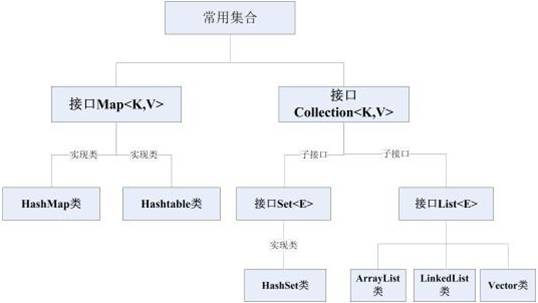

# 集合




**集合的特点:**

•Set集合和List集合都是继承自Collection接口

•List元素可以重复,Set集合元素不能重复

•ArrayList线程不安全 效率高,Vector线程安全 效率低(常用的效率高但线程不安全)

•HashMap线程不安全 效率高,HashTable线程安全 效率低


## List集合

**特点:单列集合,元素可以重复**

只读\可增改\java的集合

```kotlin
fun main(args: Array<String>) {
    //listOf只读list集合,不能增\改元素,适用于声明已确定的集合
    val list1= listOf("林青霞","高圆圆","范冰冰")

    //mutableListOf可增改的list集合
    val list2= mutableListOf("林青霞","高圆圆","范冰冰")
    list2.set(0,"柳岩")                   //将第0个元素改为"柳岩"
    list2.add(1,"刘诗诗")      			//在第1个元素的位置添加"刘诗诗"
    println(list2)

    //java的集合
    val list3= arrayListOf("林青霞","高圆圆","范冰冰")
    val list4=ArrayList<String>()
    val vector= Vector<String>()

}
```

**遍历:用集合名.foreach{println(it)}**


## Set集合

**特点:单列集合,元素不能重复**

只读\可增改\自动排序 集合

```kotlin
fun main(args: Array<String>) {
    //setof只读集合,适用于已固定不用修改的集合定义
    val set1= setOf("张三","李四","王五","李四")
    //输出时会将重复的元素"李四"自动剔除

    
    //mutableSetOf()可增\改集合
    val set2= mutableSetOf("张三","李四","王五","李四")
    set2.add("赵六")
   
    
    //java的set集合
    //TreeSet<T>()输出时可自动将元素排序的集合
    val treeSet=TreeSet<String>()
    treeSet.add("z")
    treeSet.add("f")
    treeSet.add("e")
    treeSet.add("a")
    println(treeSet)

    //Treeset元素需要实现Comparable比较接口才能对对象进行排序
    val treeSet2 = TreeSet<Person>()
    treeSet2.add(Person("林青霞",20))
    treeSet2.add(Person("张曼玉",30))
    treeSet2.add(Person("张三",60))
    println(treeSet2)
}
class Person(var name:String,var age:Int)
```


## Map集合

**特点:双列集合**

```kotlin
fun main(args: Array<String>) {
    
  //mapOf(A to B)只读map集合,A和B直接输入,map会自动推断类型
    val map=mapOf("中国" to "China","英国" to "England")
  	
  //mutableMapOf(A to B)可增改map集合
    val map= mutableMapOf("中国" to "China","英国" to "England")
    map.set("美国","America")
  	
  //java的集合hashmap和hashtable,前者线程不安全但效率高,后者线程安全但效率低
   	val hashmap= hashMapOf<String,String>("撒旦法师" to "fdfs","dfsfs" to "dfsfsd")
    val hashtable=Hashtable<String,String>("dfsf" to "dsfsf")
    
    //遍历方式一:键值分开遍历
    val keySet=map.keys
    keySet.forEach { println(it) }
    val values=map.values
    values.forEach { println(it) }
    
    //遍历方式二:用高阶for循环遍历
    map.forEach { t,u->
        println("key=$t value=$u")
    }
    
    //遍历方式三:用普通for循环遍历
    for ((key,value)in map){
        println("key=$key value=$value")
    }
}
```

* **集合小结:**常用单列集合有list和set.分别有只读(不可增改)的listOf和setOf;可增改的mutableListof和mutableSetof,其中set集合有自动排序功能,遍历这两种集合可用for或foreach方法. 常用的双列集合有map集合,同样有分为只读的mapof和可增改的mutableMapof两种.因其有键值对,因此初始化方式是键to值.它的遍历可以将key和value分别放到单列集合中用两种for循环遍历,还可以直接用两种for循环遍历.


# List集合中的一些高阶函数和lambda表达式

## 过滤

### **(filter方法的原理:)**

fun <T>:泛型函数

Iterable<T>:只要是可迭代的函数都行

.filter(predicate: (T) -> Boolean):Iterable类的扩展函数,这个函数的参数是函数参数,filter方法是个高阶函数.

这个可迭代函数调用filter这个方法,如果是迭代的每个元素满足自定义的条件返回true,就返回一个list集合

```kotlin
public inline fun <T> Iterable<T>.filter(predicate: (T) -> Boolean): List<T> {
    return filterTo(ArrayList<T>(), predicate)
}
```

**代码:**

```kotlin
val list1 = list.filter {
    it.place=="河南"			//写一个filter的lambda表达式,返回由全满足条件的元素组成的集合
}
```

**特点:在{}中输入条件判读语句,如果为true,返回list集合**

### **(find方法的原理:)**

只要是能迭代的函数如果传入的判断类型的lambda表达式为true则返回迭代函数本身的类,如果能迭代的函数为空就返回null

```kotlin
public inline fun <T> Iterable<T>.find(predicate: (T) -> Boolean): T? {
    return firstOrNull(predicate)
}
```

**代码:**

```kotlin
val list1 = list.find {
    it.startsWith("张")				//找到第一个姓张的人
}
```

**特点:在{}中输入条件判断语句,如果为true,返回调用函数的类型**

### **(filterTo方法的原理:)**

fun <T, C : MutableCollection<in T>>:设置泛型函数的上限是可增改集合及其子类

判断条件如果为true,就把元素添加进这个集合中去最后返回集合

```kotlin
public inline fun <T, C : MutableCollection<in T>> Iterable<T>.filterTo(destination: C, predicate: (T) -> Boolean): C {
    for (element in this) if (predicate(element)) destination.add(element)
    return destination
}
```

**代码:**

```kotlin
val mulList = mutableListOf<String>()			//创建mutable集合的对象
list.filterTo(mulList){							//传入该对象,只有一个参数()可前提
    it.startsWith("张")
}
```

**用法:**创建mutable集合的对象,传入该对象作为参数,在{}中输入条件判断语句.将满足条件和元素添加进该集合

### (filterIndexed方法的使用:)

通过筛选角标过滤出符合条件的元素装进list集合

**代码:**

```kotlin
val list5 = list.filterIndexed { index, s ->
    index%2 == 0							//过滤出偶数角标的元素放进集合并返回
}
```


## 排序

**正序排序:l**ist.sorted()

**倒序排序:**list.sortedDescending()

**按字段正序排序:**list.sortedBy{it.可排序属性名}

**按字段倒序排序:**list.sortedByDescending{it.可排序属性名}

**代码:**

```kotlin
 	val list1 = listOf(Person("林青霞",50),Person("张曼玉",30),Person("柳岩",70))
    list1.sorted()
    val list3 = list1.sortedBy { it.age }				//按年龄正序排序
    println(list3)
    val list4 = list1.sortedByDescending { it.age }		//按年龄倒序排序
    println(list4)
```


## 分组

### (.groupBy方法的原理:)

Iterable<T>:可迭代的类,T代表类的类型.对于集合来说,它的类型就是它的元素.因此对于姓名集合来说,如果keySelector返回的是姓氏,则groupBy返回的是带有姓氏的元素

```kotlin
/*Groups elements of the original collection by the key returned by the given [keySelector] function*/
/*根据keySelector方法返回的key值分成一个包含其key值字段的集合*/
public inline fun <T, K> Iterable<T>.groupBy(keySelector: (T) -> K): Map<K, List<T>> {
    return groupByTo(LinkedHashMap<K, MutableList<T>>(), keySelector)
}
```

**用法:**在方法体中输入带有分组特征的字段

**需求:**将不同姓氏的名字分在各自姓氏的集合下

**思路:**判断,分组

**代码:**

```kotlin
fun main(args: Array<String>) {
    val list = listOf("张三", "李四", "王五", "赵六", "张四", "李五", "李六")
    //姓张的一组 姓李的一组 其他一组
    val map = list.groupBy {
        val first = it.substring(0,1)
        when(first){
            "张"->"张"
            "李"->"李"
            else->"其他"
        }
    }
    println(map)
}
```

**运行结果:**

{张=[张三, 张四], 李=[李四, 李五, 李六], 其他=[王五, 赵六]}


## 最值

**获取集合中的数字,字母等:**

list.max()

list.min()

**需求:**获取z,g,r三个字母中的最值

**代码:**

```kotlin
fun main(args: Array<String>) {
    val  list = listOf("z","g","r")
//    最大值
    println(list.max())
//    最小值
    println(list.min())
```

**获取对象的最值:**

list.maxBy{it.可比较的属性}

**需求:**按年龄获取三人中最大和最小的年龄者

**代码:**

```kotlin
fun main(args: Array<String>) {
	val list1 = listOf(Person("林青霞",50),Person("张曼玉",30),Person("柳岩",70))
//    对象最大值
    list1.maxBy { it.age }	
//    对象最小值
    list1.minBy { it.age }

}
```


## 去重复

利用set集合去重的特性,将list集合转换成set集合:

list.toSet()

需求:将list集合中相同姓氏的人去除

代码:

```kotlin
fun main(args: Array<String>) {
    val list = listOf("张三","李四","王五","赵六","张四","李五","张三","李六")
//    把重复的张三去掉
    val set = list.toSet()
    println(set)
}
```

**用list.distinct()去重返回同样是list类型的集合:**

list.distinct()

**用list.distinctBy{}去重返回同样是list类型的集合:**

**用法:**在{}中截取元素字符串的首字符,如果直接输入"张"将返回带张姓的元素组成的集合

**代码:**

```kotlin
println(list.distinctBy {
    //张  李  王   赵
    it.substring(0, 1)

})
```


## 集合的拆封

### (.partition方法的原理 :)

如果partition的lambda表达式判断结果为true,则返回一个二元元组,元组的第一个元素是满足判断条件的包含判断字段的元素的集合,第二个元素是其它可迭代类的元素组成的集合

```kotlin
public inline fun <T> Iterable<T>.partition(predicate: (T) -> Boolean): Pair<List<T>, List<T>> {
    val first = ArrayList<T>()
    val second = ArrayList<T>()
    for (element in this) {
        if (predicate(element)) {
            first.add(element)
        } else {
            second.add(element)
        }
    }
    return Pair(first, second)
}
```

**需求:**将姓张的分在一个集合,其它分在另一个集合

**用法:**在partition的lambda表达式中做判断,是否以"张"开头,并打印输出pair的两个元素

**代码:**

```kotlin
fun main(args: Array<String>) {
    val list = listOf("张三","李四","王五","赵六","张四","李五","张三","李六")
    //姓张的一部分,另外的一部分
    val pair = list.partition {
        it.startsWith("张")
    }
    println(pair.first)
    println(pair.second)

}
```


## 集合重新组合

list.map{}

**需求:**获取由集合中各姓氏组成的集合

**代码:**

```kotlin
fun main(args: Array<String>) {
    val list1 = listOf(Person("林青霞",50),Person("张曼玉",30),Person("柳岩",70))
    //将Person里面每一个name获取
    val list2 = list1.map {	
        it.name.substring(0,1)					//姓氏
    }
    println(list2)
}
```


## 集合相加

**指定将集合中某个属性相加**

list.sumBy{}

**需求:**求所有人年龄之和

**代码:**

```kotlin
fun main(args: Array<String>) {
    val list = listOf(Person("林青霞",50),Person("张曼玉",30),Person("柳岩",70))
    //求出所有人的年龄之和
    println(list.sumBy {
        it.age
    })
}
```


# 函数式编程

**主要编程范式(编程风格):**

面向对象编程OOP(Object Oriented Programming) :如Java

面向过程编程:如C语言

函数式编程FP(Function Programming):Java 在JDK1.8后支持;kotlin支持

## 闭包

**函数式编程的典型体现,一个函数返回了一个内部函数，该内部函数引用了外部函数的相关参数和变量，我们把该返回的内部函数称为闭包.在kotlin里面通常说的闭包就是lambda表达式.**

```kotlin
fun main(args: Array<String>) {
    /*test()
    test()
    test()*/
    val result=test()	//将test函数赋值给result
    result()            //可以返回函数
    result()
    result()
}
//函数不保存状态,调用一次执行完就销毁,下次调用该函数状态清零,因此每次都输出10
/*fun test(){
    var a = 10
    println(a)
    a++
}*/

//闭包的体现:函数可以作为方法的返回值 方法可以作为函数的参数
fun test():()->Unit{
    var a = 10
    return{         //return的就是闭包
        println(a)
        a++
    }
}
```

## 高阶函数

**概念:**函数中传递函数参数的函数

**函数参数的格式:**函数参数名:(函数参数需要的参数1,函数参数需要的参数2)->函数参数的返回值

```kotlin
fun main(args: Array<String>) {
    var a =10
    var b =20
    var sum = 0
    var result=0
  
    sum=cacl1(a,b,::add)				//调用高阶函数第三个参数应为函数的引用
    result=cacl1(a,b,::sub)
}
  
fun cacl1(a:Int,b:Int,block:(Int,Int)->Int):Int{ //block:传递的工具;返回值:使用工具求出的值
    val result=block.invoke(a,b)		//在高阶函数内调用第三个函数参数
    return result						//返回函数调用值
}

fun add(a:Int,b:Int):Int{				//初识化要调用和引用的函数工具
    return a+b
}
fun sub(a:Int,b:Int):Int{
    return a-b
}
```

## lambda表达式

**概念:**调用高阶函数时在函数参数位置传入的匿名函数称为lambda表达式.

**特点:**只能自己用,别人不可调用

**lambda表达式的格式**:和函数参数一致,箭头后的返回值可直接书写表达式,kotlin会自动推断返回值类型

**代码:**

```kotlin
fun main(args: Array<String>) {
    var a = 10
    var b = 20
    var sum = 0
    var result = 0 
    
    sum = cacl(a,b,{m:Int,n:Int->		//第三个参数是lambda表达式
        m+n  
    })
    result = cacl(a,b,{m,n->
        m+n
    })

    println(sum)
    println(result)
}

fun cacl(m:Int,n:Int,block:(Int,Int)->Int):Int{
    val result = block(m,n)
    return result
}
```

**如果调用高阶函数时最后一个参数是lambda表达式,可以把()前移到前两个参数的位置**

```kotlin
sum = cacl(a, b) { m, n ->				//括号前移
    m + n
}
```

## lambda表达式单独存在

**特点:**lambda表达式可以作为匿名嵌套函数初始化并调用

**代码:**

```kotlin
fun main(args: Array<String>) {
       {
              println("hello")			//嵌套的lambda表达式,可直接{}()调用,但用												{}?.invoke()调用可空
          }?.invoke()
 }
```

## 有参的lambda表达式

**特点:**可在嵌套的lambda表达式中传参

**代码:**

```kotlin
fun main(args: Array<String>) {
    //嵌套有参的lambda表达式  实现a+b的和
    val result = {a:Int,b:Int->
        a+b
    }.invoke(10,20)
    println(result)
}
```

## 保存lambda表达式

**特点:**定义一个参数把表达式赋值给它就能实现多次调用匿名函数,即用参数保存表达式

保存过的lambda表达式不仅可以作为嵌套函数初始化和调用,还能作为顶层函数初识化和调用

**代码:**

```kotlin
fun main(args: Array<String>) {
   
    val block:(()->Unit)? = null 			//保存可空的函数变量类型
    val block2={							//保存普通的lambda表达式
             println("hello")
            }
   
    block()									//lambda表达式的调用
    block?.invoke()							//lambda表达式的非空调用

    test()									//调用作为顶层函数的lambda表达式同理
    test()
}
val test = {								//保存过的lambda表达式还能作为顶层函数使用
    println("hello")
}
```

## lambda表达式it的使用

**概念:**lambda表达式使用的时候如果只有一个参数可以省略参数名,默认是通过it来实现的

**代码:**

```kotlin
fun main(args: Array<String>) {

    var a = 10
  
    val result = haha(a, {						//只有一个参数可直接用it表示
        it + 10
    })
    println(result)
}

fun haha(m: Int, block: (Int) -> Int): Int {
    val result = block(m)
    return result
}
```

**lambda表达式返回的最后一行的返回值**


# 四大函数

### apply函数

apply函数的返回值是调用者本身,使用this代表当前对象,apply函数可空

**需求:**增加移动这个姓名到集合中

**代码:**

```kotlin
fun main(args: Array<String>) {
    val list= arrayListOf("张三","李四","王五","赵六")
    list?.apply {
        add("移动")
    }
    println(list)
}
```

**(apply函数的原理:)**

 T.apply(...):任意函数都能调用apply函数

block: T.() -> Unit:带接受者的函数字面值,即定义在T对象中的函数

```kotlin
public inline fun <T> T.apply(block: T.() -> Unit): T {
    contract {
        callsInPlace(block, InvocationKind.EXACTLY_ONCE)
    }
    block()
    return this
}
```

**扩展知识:**Data.()->Unit函数参数的声明和调用

```kotlin
fun set(block:Data.()->Unit){				//声明高阶函数
    block(Data())							//调用带类名的扩展函数的两种方式 类名.方法名
    Data().block()
}
class Data{									//创建Data类
    var name = "张三"
    fun haha(){

    }
    fun sayHello(){
        this.haha()
        haha()
        name
    }
}
```

### let函数

和set函数类似,但用it表示调用者本身,返回值是let函数的最后一行

**需求:**往姓名集合中添加三个张三

**代码:**

```kotlin
fun main(args: Array<String>) {
    val list= arrayListOf("张三","李四","王五","赵六")
    list?.let {
        it.add("张三")
        it.add("张三")
        it.add("张三")

    }
    println(list)
}
```

### with函数

with是独立的函数,可以在任意地方调用,相当于apply和let的结合

with函数需要接收两个了参数

第一个参数可以接收任意类型

第二个参数是函数参数,是带接收者的函数字面值,接收者就是第一个参数

返回值是第二个函数参数的返回值

**需求:**往集合中添加两个空格

**代码:**

```kotlin
fun main(args: Array<String>) {
    val list= arrayListOf("张三","李四","王五","赵六")
    with(list){
        this.add("")
        this.add("")
        add("")
        "哈哈"
        10
    }
    println(list)
}
```

### run函数

任意类型都有run扩展函数

它的参数是带接收者的函数,接收者是调用者本身

返回值就是函数参数的返回值

**需求:**往集合中添加空格元素

**代码:**

```kotlin
fun main(args: Array<String>) {
    val list= arrayListOf("张三","李四","王五","赵六")
    list.run {
        this.add("")
        "哈哈"
    }
    println(list)
}
```


# 接口回调

**需求:**妈妈和儿子去超市买酱油,酱油卖完了,超市服务员要到仓库找5秒钟,妈妈不等了,让儿子留在超市把酱油带回来,自己先回家做甜点,等儿子拿到酱油再做饭

新建妈妈\超市\酱油 三个类,主体确定是妈妈,在妈妈类中定义main函数

**妈妈类中的逻辑:**去超市 -> 从超市中买酱油 -> 先做甜点再做饭

**超市类的逻辑:**有可以买到酱油的方法,买酱油时刚好没货了,需要在仓库中找5分钟

**酱油类的逻辑:**有各种牌子的酱油可供挑选

做甜点不需要买酱油,妈妈不想等买酱油,找到后再给她,但由于等待5秒的线程阻塞了主线程导致只能先等5分钟再执行后续操作,因此可以开启新线程

**问题:**在超市的buySoy方法中开启新线程,但无法将soy对象返回,如下所示:

```kotlin
public Soy buySoy(){
   new Thread(new Runnable() {
       @Override
       public void run() {
            try {
                Thread.sleep(5000L);
            } catch (Exception e) {
                e.printStackTrace();
            }
           Soy soy= new Soy("海天酱油");
           return soy;					//此处报错,无法将soy对象返回给buySoy方法

       }
   }).start();
}
```

解决:让儿子把找到的酱油带回去

儿子类的逻辑:有能力把酱油取回来的能力

代码优化:只要有能取回酱油能力的对象都可以去超市取酱油,在超市类买酱油的方法中传入接口对象(多态)

**代码:**

```java
package Practice_Code.接口回调;

/**
 * ClassName:Mother
 * Description:
 */
class Mother {
    public static void main(String[] args){
        //去超市
        Supermarket supermarket= new Supermarket();
        //去超市买酱油
        supermarket.buySoy(new Son());
//        System.out.println("买到了"+soy.name);
        //做菜
//        System.out.println("妈妈开始做菜了");
        System.out.println("妈妈开始做甜点了");
    }

    interface getSoy{
        void feedbackSoy(Soy soy);
    }

    static class Son implements getSoy{
        @Override
        public void feedbackSoy(Soy soy) {
            System.out.println("儿子拿到了"+soy.name);
            System.out.println("妈妈开始做菜");
        }
    }
}

```

```java
package Practice_Code.接口回调;

/**
 * ClassName:Supermarket
 * Description:
 */
class Supermarket {

    //买酱油的方法
        public void buySoy(Mother.getSoy getsoy){			//传入的参数是Mother中接口
           new Thread(new Runnable() {
               @Override
               public void run() {
                    try {
                        Thread.sleep(5000L);
                    } catch (Exception e) {
                        e.printStackTrace();
                    }
                    Soy soy= new Soy("海天酱油");
                   getsoy.feedbackSoy(soy);		//将接口传回到实现接口的对象对应的方法中
               }
           }).start();
        }
}
```

```java
package Practice_Code.接口回调;

/**
 * ClassName:Soy
 * Description:
 */
class Soy {
    String name;

    public Soy(String name) {
        this.name = name;
    }
}

```

###接口回调的流程

1.定义具备某种能力的接口

```java
interface getSoy{					//可以拿回酱油的能力接口
    void feedbackSoy(Soy soy);
}
```

2.传递接口给supermarket

3.supermarket在指定的时候可以通过传递的接口将数据传回去

4.在传递的对象对应的方法中接收数据

## 函数回调

### 函数回调的流程

1.将某个高阶函数给supermarket

2.supermarket在指定的时候可以通过函数参数将数据传回去

3.在其它类中通过调用lambda表达式接收函数参数

```kotlin
package Practice_Code.函数回调


/**
 * ClassName:Mother
 * Description:
 */

fun main(args: Array<String>) {
    //去超市
    var supermarket = Supermarket()

    //在超市买到酱油
    supermarket.buySoy{								//用lambda表达式接收函数参数
        println("儿子取回了${it.name}")
        //做饭
        println("妈妈开始做饭了")
    }
    //做甜点
    println("妈妈开始做甜点了")
}
```

```kotlin
package Practice_Code.函数回调


/**
 * ClassName:supermarket
 * Description:
 */
class Supermarket{
    fun buySoy(block:(Soy)->Unit){					//传入匿名函数
        Thread{
            Thread.sleep(5000L)
            val soy=Soy("海天酱油")
            block(soy)
        }.start()
    }
}
```

```kotlin
package Practice_Code.函数回调


/**
 * ClassName:Soy
 * Description:
 */
class Soy(var name:String)
```

**更改需求:妈妈不要酱油了**

```kotlin
package Practice_Code.函数回调


/**
 * ClassName:Mother
 * Description:
 */

fun main(args: Array<String>) {
    //去超市
    var supermarket = Supermarket()

    //在超市买到酱油
    supermarket.buySoy(null)						//不要酱油了
    //做饭
    println("妈妈开始做饭了")
    //做甜点
    println("妈妈开始做甜点了")
}


```

```kotlin
package Practice_Code.函数回调


/**
 * ClassName:supermarket
 * Description:
 */
class Supermarket{
    fun buySoy(block:((Soy)->Unit)?){				//传入可空类型函数参数
        Thread{
            Thread.sleep(5000L)
            val soy=Soy("海天酱油")
            block?.invoke(soy)						//block可空类型的调用方式
        }.start()
    }
}
```

```kotlin
package Practice_Code.函数回调


/**
 * ClassName:Soy
 * Description:
 */
class Soy(var name:String)
```

