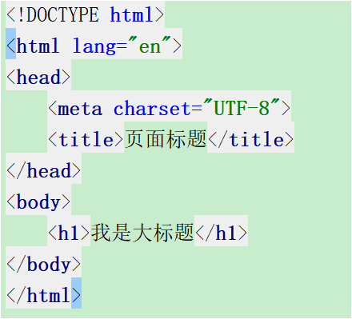
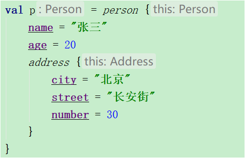
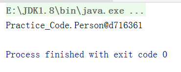
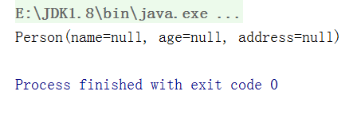

# Kotlin_Day06笔记


# DSL

**视频源:**04.DSL简介.avi

**概念:**DSL(Domain-Specific Language,领域特定语言)指的是专注于特定问题领域的计算机语言;不同于通用的计算机语言(GPL general purpose language),领域特定语言只用在某些特定的领域;领域可能是某一种产业,保险 教育 航空 医疗,也可能是一种方法或技术,比如数据库SQL html…


**特点:**DSL只是问题解决方案模型的外部封装,这个模型可能是一个API库,也可能是一个完整的框架;没有具体的标准来区分DSL和普通的API,DSL代码更易于理解，不仅对于开发人员而且对于技术含量较低的人员来说也更易于理解.



**需求:**封装问题模型如下图




## 如何写DSL的封装框架

从DSL语言的外层往里层分析解决

**1.实现person函数**

1.最终要返回一个person对象 -> 创建person类,其中的参数有name,age和address对象,person{}调用了person的扩展高阶函数,返回值是person对象

```kotlin
fun main(args: Array<String>) {
    val person: Person =
            person {
                name= "徐熊丽"
                age = 30

                address{
                    city = "深圳"
                    street = "宝安街道"
                    number = 114
                }
            }
    println(person)
}

fun person(block:Person.()->Unit):Person{
    val person=Person()						//报错:未传参
    return person
}


class Person(var name:String,var age:Int,var address:Address)
class Address(var city:String,var street:String,var number:Int)
```

2.要在main函数中传参,不能在person扩展函数中创建person对象时传参 -> 初始化Person时传入默认参数

```kotlin
class Person(var name:String?=null,var age:Int?=null,var address:Address?=null)
class Address(var city:String?=null,var street:String?=null,var number:Int?=null)
```

输出结果:



3.返回的应该是能打印处的Person对象 -> 给Person类包装成数据类,数据类自带toString方法能打印输出类中的参数

输出结果:



**2.实现name属性的赋值**

