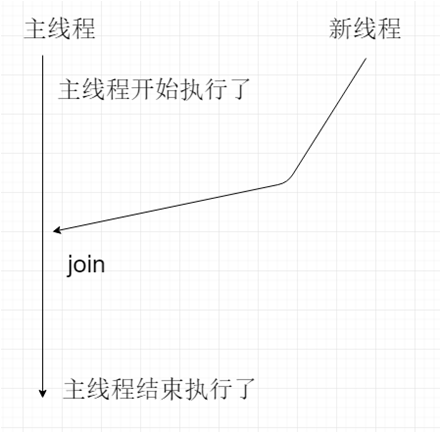
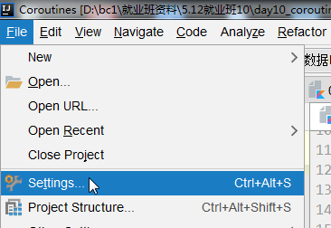
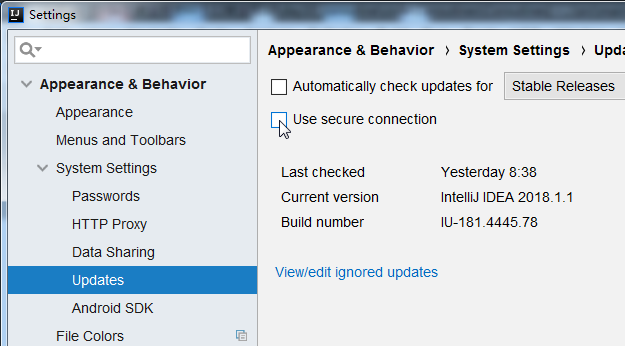
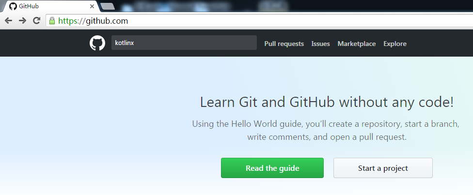
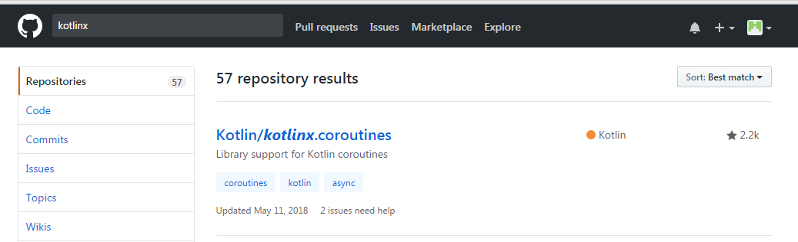
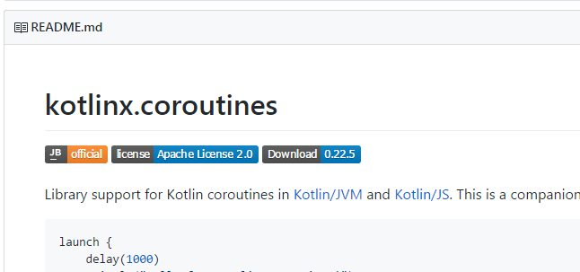
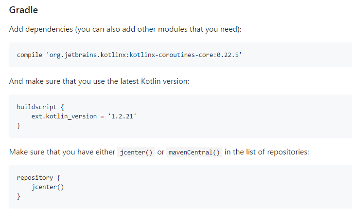
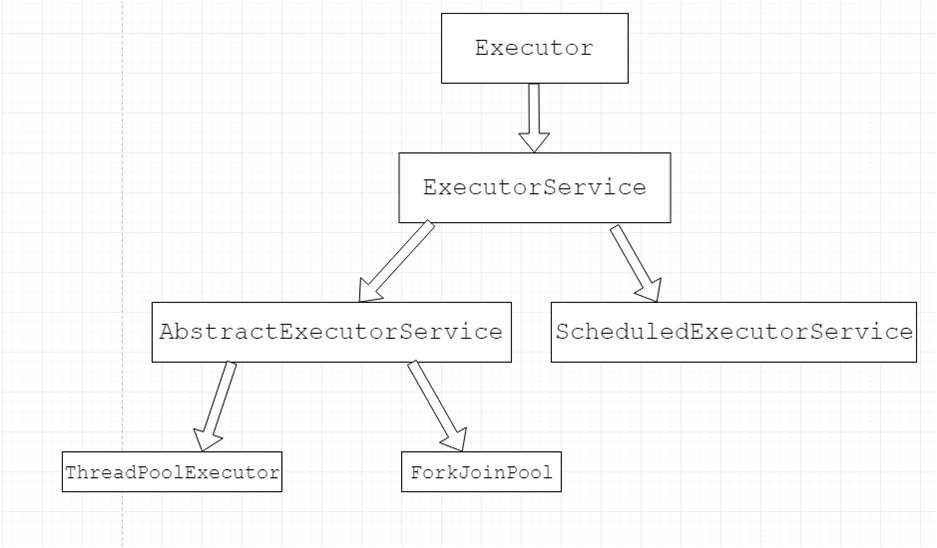

#Kotlin_Day10笔记


### 进程和线程的区别

**视频源:**01.工程准备.avi

**概念:**进程:一个启动的应用程序,一个进程可以包含很多线程

​	线程是系统中最小的执行单元,线程以进程为载体,不能单独存在

​	启动应用程序启动进程,进程在默认情况下会启动主线程main


### 创建线程的两种方式

**视频源:**02.创建线程的两种方式.avi

**需求:**每500毫秒打印一个数字,从1-10

**通过Thread方式创建线程的代码:**

```kotlin
class Main {
    public static void main(String[] args){
        System.out.println("主线程开始执行");
       
        MyThread thread = new MyThread();				//创建Thread的子类对象
        thread.setName("线程1");							//命名线程
        thread.start();									//通过子类对象开启线程
		System.out.println("主线程结束执行");
	}
}
```

```kotlin
class MyThread extends Thread {							//创建一个类继承Thread
    @Override
    public void run() {									//重写run方法
        
        for (int i = 0; i < 10; i++) {
            System.out.println(getName()+"-打印了"+i);		//获取线程名
            try {
                Thread.sleep(500L);
            } catch (InterruptedException e) {
                e.printStackTrace();
            }
        }
    }
}
```

**通过继承Runnable接口创建线程的代码:**

```kotlin
class Main {
    public static void main(String[] args){
     MyRunnable runnable = new MyRunnable();			//创建子类对象
        Thread thread = new Thread(runnable);			//创建Thread对象	
        thread.setName("线程2");
        thread.start();									//开启线程
        System.out.println("主线程结束执行");
     }
}
```

```kotlin
class MyRunnable implements Runnable {					//创建一个类实现Runnable接口
    @Override
    public void run() {
        for (int i = 0; i < 10; i++) {
            System.out.println(Thread.currentThread().getName()+"-打印了"+i);
            try {
                Thread.sleep(500L);
            } catch (InterruptedException e) {
                e.printStackTrace();
            }
        }
    }
}
```


### Thread和Runnable方法的对比

**视频源：**03.通过Thread直接卖票缺点.avi

**概念：** 通过Thread直接卖票

**需求：** 分三个窗口卖100张票

**代码:**

```kotlin
class Main {
    public static void main(String[] args){
    
        TicketThread thread1 = new TicketThread();
       
        TicketThread thread2 = new TicketThread();
    
        TicketThread thread3 = new TicketThread();

        thread1.setName("窗口1");
        thread2.setName("窗口2");
        thread3.setName("窗口3");

        thread1.start();
        thread2.start();
        thread3.start();
      }
}
```

```kotlin
class TicketThread extends Thread {
    private int ticket = 100;
    @Override
    public void run() {
        while (true){
            if(ticket>0){
                System.out.println(getName()+"卖出第"+ticket+"张票");
                ticket--;
            }
        }
    }
}
```

**运行结果**

```kotlin
窗口2卖出第100张票
窗口3卖出第100张票
...
```

**问题**

各线程独立卖100票张票而不是共享一起卖100张票

**总结**

用Thread创建的线程各线程独立处理各自数据,如果想让各线程共享处理数据要用Runnable的方式开启线程

------

**视频源：**04.通过Runnable方式共享线程间数据.avi

**概念：** 通过Runnable方式共享卖票

**需求：** 分三个窗口卖100张票

**代码:**

```kotlin
class Main {
    public static void main(String[] args){
      TicketRunnable runnable = new TicketRunnable();
        Thread thread1 = new Thread(runnable);
        Thread thread2 = new Thread(runnable);
        Thread thread3 = new Thread(runnable);

        thread1.setName("窗口1");
        thread2.setName("窗口2");
        thread3.setName("窗口3");

        thread1.start();
        thread2.start();
        thread3.start();

    }
}
```

```kotlin
class TicketRunnable implements Runnable {
    private int ticket = 100;
    @Override
    public void run() {
        while (true){
            //加上同步锁
            synchronized (TicketRunnable.class) {
                if (ticket > 0) {
                    System.out.println(Thread.currentThread().getName() + "卖出第" + ticket + "张票");
                    try {
                        Thread.sleep(10L);
                    } catch (InterruptedException e) {
                        e.printStackTrace();
                    }
                    ticket--;
                }
            }
        }
    }
}
```

**运行结果**

```kotlin
窗口3卖出第100张票
窗口3卖出第99张票
窗口3卖出第98张票
窗口1卖出第97张票
窗口2卖出第96张票
窗口1卖出第95张票
```

**小细节（注意事项）**

 线程安全问题:各线程没有共享处理数据

**线程安全问题出现的原因(同时满足以下3个条件就会出现):**

是否是多线程

是否有共享数据

是否有多条语句操作共享数据

**解决方案:**用同步代码块的方式同步关键字(把多条语句放在一起执行)

**总结**

给每个Thread对象中传入加同步代码锁的Runnable对象能使各线程运行时能共享处理数据

------


###线程join

**视频源：**06.线程join.avi

**概念：** 将线程之间的并行执行变为串行执行,必须要等到当前线程执行结束才能结束,相当于把线程的并行执行变成了串行执行



**需求：** 每隔500毫秒打印一个数字,总共打印10个数字

**代码:**

```kotlin
class Main {
    public static void main(String[] args){
       
        System.out.println("主线程开始执行");

        MyThread thread = new MyThread();
        thread.setName("线程1");
        thread.start();
        //join  必须要等到当前线程执行结束 才能结束  相当于把线程的并行执行 变成了串行执行
        try {
            thread.join();
        } catch (InterruptedException e) {
            e.printStackTrace();
        }

        System.out.println("主线程结束执行");
    }
}
```

```kotlin
class MyThread extends Thread {
    @Override
    public void run() {
        //每隔500毫秒 打印一个数字  总共打印10个数字
        for (int i = 0; i < 10; i++) {
            System.out.println(getName()+"-打印了"+i);
            try {
                Thread.sleep(500L);
            } catch (InterruptedException e) {
                e.printStackTrace();
            }
        }
    }
}
```

**运行结果**

```kotlin
主线程开始执行
线程1-打印了0
线程1-打印了1
线程1-打印了2
线程1-打印了3
线程1-打印了4
线程1-打印了5
线程1-打印了6
线程1-打印了7
线程1-打印了8
线程1-打印了9
主线程结束执行
```


###用户线程

**视屏源:**07.守护线程.avi

**概念:**主线程执行结束,用户线程可以继续执行

**代码:**

```kotlin
class Main {
    public static void main(String[] args){
        //用户线程  主线程执行结束 用户线程可以继续执行
        //主线程执行结束之后 垃圾回收线程也应该终止掉 垃圾回收线程就是属于守护线程
        //执行没有顺序 并行执行
        System.out.println("主线程开始执行");


        MyThread thread = new MyThread();				//线程1为用户线程
        thread.setName("线程1");
        thread.start();


        System.out.println("主线程结束执行");
    }
}
```

**输出结果:**

主线程开始执行
主线程结束执行
打印了1
打印了2
打印了3
打印了4
打印了5
打印了6
打印了7
打印了8
打印了9
打印了10

### 守护线程

**概念:**在程序运行的时候在后台提供一种通用的服务的线程

**特点:**主程序执行结束,守护线程也结束

**例:**java中默认有主线程和垃圾回收线程,当主线程执行结束后垃圾回收线程也结束了,因此垃圾回收线程为守护线程

**将线程设置为守护线程:**Thread的setDaemon方法:可将线程设置为用户线程或守护线程,必须在线程启动前调用

**代码:**

```kotlin
class Main {
    public static void main(String[] args){
       
        System.out.println("主线程开始执行");


        MyThread thread = new MyThread();
        thread.setName("线程1");
        
        											//主线程执行结束之后 线程就停止了
        thread.setDaemon(true);						//设置为守护线程  必须在启动前调用

        thread.start();


        System.out.println("主线程结束执行");
    }
}
```

**输出结果:**

主线程开始执行
主线程结束执行
线程1-打印了0


###线程池

**视频源：**08.线程池.avi

**普通线程Vs线程池:**普通线程执行完后会被系统执行垃圾回收线程,等下次再用时还要再创建新的线程,如此反复对系统的内存要求过高.

而线程池里的每一个线程代码结束后,并不会死亡,而是会再次回到线程池中成为空闲状态,等待下一个对象来使用

**概念：** 线程池里的每一个线程代码结束后,并不会死亡,而是会再次回到线程池中成为空闲状态,等待下一个对象来使用

**扩展:**在JDK5之前,我们需要自己手动实现自己的线程池,从JDK5开始,java内置支持线程池

**需求：** 创建线程池

**代码:**

```kotlin
class Main {
    public static void main(String[] args){
        //创建线程池
        //创建线程池 指定线程数量
        ExecutorService service =  Executors.newFixedThreadPool(3);//单核cpu 真实开发可以设置成核心数-1
        //执行多线程操作
        //可以通过execute执行 执行对象就是Runnable对象
        MyRunnable runnable = new MyRunnable();
        service.execute(runnable);	
        service.execute(runnable);
        //线程池线程执行完成之后比并没有走销毁流程 而是回到线程池中 成为初始状态 等待下次执行
    }
}
```

```kotlin
class MyRunnable implements Runnable {	//创建一个类实现Runnable接口
    @Override
    public void run() {					//重写run方法
        for (int i = 0; i < 10; i++) {
            System.out.println(Thread.currentThread().getName()+"打印"+i);
            try {
                Thread.sleep(500L);
            } catch (InterruptedException e) {
                e.printStackTrace();
            }
        }
    }
}
```

**运行结果**

```kotlin
pool-1-thread-1打印0
pool-1-thread-2打印0
pool-1-thread-2打印1
pool-1-thread-1打印1
pool-1-thread-2打印2
pool-1-thread-1打印2
pool-1-thread-1打印3
pool-1-thread-2打印3
pool-1-thread-2打印4
pool-1-thread-1打印4
pool-1-thread-2打印5
pool-1-thread-1打印5
pool-1-thread-2打印6
pool-1-thread-1打印6
pool-1-thread-2打印7
pool-1-thread-1打印7
pool-1-thread-2打印8
pool-1-thread-1打印8
pool-1-thread-2打印9
pool-1-thread-1打印9
```

**小细节（注意事项）**

 注意：当启用的线程数超过线程池中拥有的线程数量,则任务会分配给执行完任务回到线程池中的空闲线程执行

如果没有线程休眠命令,会出现线程安全问题,不按顺序输出结果

```kotlin
service.execute(runnable); //在线程池中启用1条线程
```

**总结**

当程序中要创建大量生命期很短的线程时,应考虑使用线程池

------


### 第一个协程启动

**视频源：**09.第一个协程启动.avi

**需求：**启动第一个协程 

**第一步:**创建gradle工程,配置kotlin的编译发布环境

**第二步:**添加仓库jcenter()和依赖

​       compile'org.jetbrains.kotlinx:kotlinx-coroutines-core:0.22.5'

0.将settings中updating中的使用安全链接的选项去勾





1.在github官网上搜索kotlinx



2.在搜索结果中选择kotlin.coroutines



3.在拖曳至README.MD说明栏中的Using in your project查看使用kotlin协程的方法






**第三步:**创建协程


**代码:**

```kotlin
fun main(args: Array<String>) {
    println("主线程开始执行")

    //开启协程
    launch {
        println("协程执行了")
    }

    println("主线程结束执行")

    //主线程睡眠
    Thread.sleep(1000L)
}
```

**运行结果**

```kotlin
主线程开始执行
主线程结束执行
协程执行了
```

**小细节（注意事项）**

 注意：要成功启动协程要让主线程休眠一会儿

```kotlin
//主线程睡眠
    Thread.sleep(1000L)
```

**总结**

要开启协程,先在本地配置kotlin的运行环境,再到github官网上搜索kotlinx查看如何导入kotlin协程库,最后开启协程时别忘了让主线程睡一会儿

------


### 用协程打印数据

**视频源：**10.协程打印数据.avi

**需求：** 用协程每隔半秒从1打印到10

**代码:**

```kotlin
fun main(args: Array<String>) {
    println("主线程开始执行")

    //开启协程
    launch {
        (1..10).forEach {
            println("打印了$it")
            //睡眠半秒钟
            Thread.sleep(500L)
        }
    }

    println("主线程结束执行")

    //主线程睡眠
    Thread.sleep(5000L)
}
```

**运行结果**

```kotlin
主线程开始执行
主线程结束执行
打印了1
打印了2
打印了3
打印了4
打印了5
打印了6
打印了7
打印了8
打印了9
打印了10
```


### launch函数的参数和返回值

**视频源：**12.launch函数的参数和返回值.avi

**需求：** 解读launch函数的原理

**代码:**

```kotlin
public actual fun launch(
    context: CoroutineContext = DefaultDispatcher,
    start: CoroutineStart = CoroutineStart.DEFAULT,
    parent: Job? = null,
    block: suspend CoroutineScope.() -> Unit
): Job {
    val newContext = newCoroutineContext(context, parent)
    val coroutine = if (start.isLazy)
        LazyStandaloneCoroutine(newContext, block) else
        StandaloneCoroutine(newContext, active = true)
    coroutine.start(start, coroutine, block)
    return coroutine
}
```

**分析**:

```
launch是一个函数 协程需要通过launch函数启动
launch前三个参数都是默认参数 参数值可以不指定
最后一个参数是函数类型 调用的时候通过lambda表达式接收
launch函数的返回值是Job类型 就是协程的任务

launch函数第一个参数:协程上下文
context类型是CoroutineContext默认值就是DefaultDispatcher(系统默认调度)

DefaultDispatcher就是CommonPool
public actual val DefaultDispatcher: CoroutineDispatcher = CommonPool

第一个参数默认情况下就是赋值为CommonPool,它是一个object单例对象
CommonPool实现原理是通过ForkJoinPool实现的
```



```kotlin
ForkJoinPool是ExecutorService的子类对象,它就是线程池.因此,协程其实也是在线程里面执行.
第一个参数就是制定协程执行在哪个线程或者线程池.
```

**总结**

launch函数中前三个参数是默认参数,第一个参数是协程上下文,制定协程执行在哪个线程或者线程池,一般默认为CommonPool,它是通过ForkJoinPool原理实现的,而ForkJoinPool是ExecutorService的子类对象,即它的本质是线程池,即协程是在线程里面执行的.最后一个参数是函数类型,返回的是Job类型,即协程的任务.

------


### ForkJoinPool的原理

**视频源：**14.ForkJoinPool的原理.avi

**概念：** ForkJoinPool是守护线程

**需求：** 验证ForkJoinPool是守护线程

**代码:**

```kotlin
fun main(args: Array<String>) {

    println("主线程开始执行")
  val service = ForkJoinPool(3)
    //创建Runable对象
    val runnable = MyRunable()
    //执行
    service.execute(runnable)

    Thread.sleep(2000L)
    println("主线程结束执行")
}
class MyRunable:Runnable{
    override fun run() {
        (1..10).forEach {
            println(it)
            Thread.sleep(500L)
        }
    }
}
```

**运行结果**

```kotlin
//主线程执行结束后由ForkJoinPool开启的线程也结束了
主线程开始执行
1
2
3
4
主线程结束执行
```

**总结**

ForkJoinPool是一个守护线程

------


### 协程启动之后的处理

**视频源：**15.协程启动之后的处理.avi

**需求：**  解决协程的线程安全问题,让协程能在主线程结束运行后继续执行

**代码:**

```kotlin
fun main(args: Array<String>) = runBlocking{
    println("主线程开始执行")

//    val job = launch {
//        println("协程执行了")
//    }

    val job = launch {
        (1..10).forEach {
            println("打印了$it")
            //睡眠5秒钟
            Thread.sleep(500L)
        }
    }

    println("主线程结束执行")
    //解决方案1:主线程睡眠
//    Thread.sleep(100L)
    //解决方案2:通过协程返回的Job任务执行join方法(main runblocking)
    job.join()
}
```

**运行结果**

```kotlin
主线程开始执行
主线程结束执行
打印了1
打印了2
打印了3
打印了4
打印了5
打印了6
打印了7
打印了8
打印了9
打印了10
```

**总结**

通过主线程和睡眠或通过协程返回的Job任务执行join方法能解决协程的线程安全问题

------


### 协程实现原理

**视频源：**17.协程实现原理.avi

**概念：** 

同步:任务在一条线程中依次执行,效率很低

异步:线程池中多条线程同时执行多个任务

阻塞:在线程中遇到延迟性任务经过等待后再继续执行,类似的等待任务有Thread.sleep()

非阻塞:在协程中的一条线程中遇到延迟性任务(挂起函数)该线程先返回线程池,执行没有延迟性任务(挂起函数)的任务,等延迟性任务等待时间到了后再让空闲的线程去执行

**总结**

由于协程的非阻塞性和线程的阻塞性造成任务执行效率的差别,用协程去执行任务比线程快很多.协程执行延迟性任务的前后可能不是一条线程,而线程执行延迟性任务前后是一条线程.

------

###协程执行原理

**视频源：**18.协程执行原理解析.avi

**概念:**协程可以把耗时任务先挂起,等时间到了再从线程池中空闲的线程执行,必须是挂起函数才能挂起

**需求：** 验证协程执行任务的非阻塞性

**代码:**

```kotlin
fun main(args: Array<String>) = runBlocking {
    //线程池
    val job = launch {
        println("协程执行前:${Thread.currentThread().name}")

       
        delay(2000L)//遇到挂起函数


        println("协程执行后:${Thread.currentThread().name}")
    }
    
    launch {			//让线程去执行其它任务		
        Thread.sleep(3000L)//非挂起函数
    }
    launch {
        Thread.sleep(3000L)
    }
    launch {
        Thread.sleep(3000L)
    }
    launch {
        Thread.sleep(3000L)
    }
    launch {
        Thread.sleep(3000L)
    }
    launch {
        Thread.sleep(3000L)
    }
    launch {
        Thread.sleep(3000L)
    }


    job.join()				
}
```

**运行结果**

```kotlin
协程执行前:ForkJoinPool.commonPool-worker-1
协程执行后:ForkJoinPool.commonPool-worker-2
```

**小细节（注意事项）**

 注意：由于launch函数是单例函数,因此多次开启后还是在同一个线程池

最后别忘了调用主线程join方法,并把主线程设为注协程解决线程安全问题

**总结**

协程执行任务是非阻塞性的

------


### 挂起函数

**视频源：**19.挂起函数.avi

**概念：** 可以被挂起执行,到时间之后从线程池中空闲的线程中恢复执行;必须通过在fun前用suspend进行修饰;必须在协程中执行或者在其它挂起函数中执行

**需求：** 定义一个挂起函数并在主函数中和launch函数中调用

**代码:**

```kotlin
fun main(args: Array<String>)= runBlocking{//主协程
    val job = launch {
        myTask()
    }
    job.join()
}
suspend fun myTask(){
    println("协程执行前")
    delay(2000L)
    println("协程执行后")
}
```

**运行结果**

```kotlin
协程执行前
协程执行后
```

**小细节（注意事项）**

 注意：

fun main(args:Array<String>):Unit=runBlocking{}  :因为join函数是一个挂起函数,只能放在协程或其它挂起函数中,如果将main函数设置为挂起函数,则程序运行时将找不到主函数入口,因此只能将main函数设置为主协程

**总结**

挂起函数必须在协程或另一个挂起函数中调用

------


### 协程和线程的效率对比

**视频源：**20.线程和协程效率对比.avi

**需求：** 用协程和线程分别打印10万个1对比两者效率

**代码:**

```kotlin
//计算线程执行任务所需时间
fun main(args: Array<String>) = runBlocking {
  val startTime = System.currentTimeMillis()

    val threadList = List(100000){
        MyThread()
    }
    threadList.forEach { it.start() }
    threadList.forEach { it.join() }
    //结束时间
    val endTime = System.currentTimeMillis()
    //耗时
    val time = endTime-startTime
    println("线程耗时$time")//8962
}
class MyThread:Thread(){
    override fun run() {
        println(".")
    }
}
```

```kotlin
//计算协程执行任务所需时间
fun main(args: Array<String>) = runBlocking {
  val startTime = System.currentTimeMillis()
    val coroutinesList = List(100000){
        launch {
            println(".")
        }
    }
    coroutinesList.forEach {
        it.join()
    }
    val endTime = System.currentTimeMillis()
    val time = endTime - startTime
    println("协程耗时$time")//918
}
```

**运行结果**

```kotlin
线程所需时间:8962ms
协程所需时间:918ms
```

**总结**

协程执行任务的效率约是线程的90倍

------


### 协程取消

**视频源：**21.协程取消.avi

**概念：** 将协程停止执行任务

**需求：**定时2秒钟停止打印1-10的协程 

**代码:**

```kotlin
fun main(args: Array<String>)= runBlocking {
    val job = launch {
        (1..10).forEach {
            println("打印$it")
            delay(500L)
        }
    }
    //定时2秒钟  停止协程
    delay(2000L)
    //取消协程
    job.cancel()

    job.join()
}
```

**用withTimeout定时取消协程**

**代码:**

```kotlin
fun main(args: Array<String>) = runBlocking {
    val job = launch {
        withTimeout(2000L) {
            (1..10).forEach {
                println("打印$it")
                delay(500L)
            }
        }
    }
    job.join()
}
```

**运行结果**

```kotlin
打印1
打印2
打印3
打印4
```

**小细节（注意事项）**

 注意：job.join()要放在程序的最后,否则程序会先串行执行完再执行定时和取消协程的命令,没有意义

**总结**

用job.cancel()手动取消停止协程

定时取消协程可先用挂起函数定时,再用job.cancel()手动取消停止协程

或直接用withTimeout方法定时取消协程

------


### 协程取消失效

**视频源：**22.协程取消失效.avi

**概念：** 协程取消可以取消挂起 ,但不能取消阻塞的Thread.sleep任务

**需求：** 让协程的取消命令失效

**代码:**

```kotlin
fun main(args: Array<String>) = runBlocking{
    val job = launch {
        (1..10).forEach {
            println("打印$it")
            Thread.sleep(500L)	//遇到阻塞性任务
        }
    }
    //定时2秒钟  停止协程
    delay(2000L)
    //取消协程
    job.cancel()//取消挂起  不能取消阻塞的Thread.sleep

    job.join()
}
```

**运行结果**

```kotlin
打印1
打印2
打印3
打印4
打印5
打印6
打印7
打印8
打印9
打印10
```

**总结**

协程取消job.cancel()可以取消挂起 ,但不能取消阻塞的Thread.sleep任务

------


### 协程取消失效的解决方案

**视频源：**23.协程取消失效的处理.avi

**概念：** 如果协程中有阻塞性任务取消协程的方法

**解决方法：** 通过在阻塞性任务前增加判断语句来控制是否继续执行协程

**代码:**

```kotlin
fun main(args: Array<String>) = runBlocking{
    val job = launch {
        //协程里面可以获取isActivie状态

        (1..10).forEach {
            if(!isActive)return@launch//用return结束需要返回值的协程launch方法
            println("打印$it")
            Thread.sleep(500L)
        }
    }
    //定时2秒钟  停止协程
    delay(2000L)

    //协程状态
    println("取消之前${job.isActive}")//true

    //取消协程
    job.cancel()//取消挂起

    println("取消之后${job.isActive}")//false

    job.join()
}
```

**运行结果**

```kotlin
打印1
打印2
打印3
打印4
打印5
取消之前true
取消之后false
```

**小细节（注意事项）**

 注意：用job.isActive可判断协程是否存在

**总结**

如果协程中有阻塞性任务,通过在阻塞性任务前增加判断语句来控制是否继续执行协程

------


### 协程async启动

**视频源：**24.协程async启动.avi

**需求：** 用async方法启动协程

**代码:**

```kotlin
fun main(args: Array<String>) = runBlocking{
   val job1 = async { job1() }
    val job2 = async { job2() }
    val result1 = job1.await()//执行完协程之后才能获取到数据
    val result2 = job2.await()
    println(result1)
    println(result2)

}
suspend fun job1():String{
    println("开始执行job1")
    delay(1000L)
    println("执行了job1")
    return "job1"
}
suspend fun job2():String{
    println("开始执行job2")
    delay(1000L)
    println("执行了job2")
    return "job2"
}
```

**运行结果**

```kotlin
开始执行job1
开始执行job2
执行了job1
执行了job2
job1
job2
```

**小细节（注意事项）**

 注意：

先开启协程job1"开始执行job1" -> 遇到挂起函数 -> 返回线程池开启协程job2"开始执行job2" -> 遇到挂起函数 -> 挂起函数等待时间到 -> 空闲线程"执行了job1" -> 挂起函数等待时间到 -> 空闲线程"执行了job2" -> 执行await命令,输出"job1""job2"

```kotlin
public actual fun <T> async(
    context: CoroutineContext = DefaultDispatcher,
    start: CoroutineStart = CoroutineStart.DEFAULT,
    parent: Job? = null,
  
    block: suspend CoroutineScope.() -> T
): Deferred<T> {//最后一个参数传入悬挂函数,async返回的是				Deferred接口
    val newContext = newCoroutineContext(context, parent)
    val coroutine = if (start.isLazy)
        LazyDeferredCoroutine(newContext, block) else
        DeferredCoroutine<T>(newContext, active = true)
    coroutine.start(start, coroutine, block)
    return coroutine
}
```

```kotlin
//Deferred返回的是job函数
public actual interface Deferred<out T> : Job {...}
```

**总结**

用launch的方式开启协程不需要返回值

用async的方式开启协程需要返回值,返回值类型是Deferred接口,它返回的是job函数,即async函数返回的是job函数

------


### 协程上下文

**视频源：**25.协程上下文指定.avi

**需求：** 指定协程代码在特定的线程中运行

**代码:**

```kotlin
fun main(args: Array<String>)= runBlocking {
    //第一个代表协程上下文 指定协程代码在哪个线程池中运行 默认是通过Commpool实现的
    val job1 = launch {
        println("协程执行")
    }
    val job2 = launch(CommonPool) {
        println("协程执行")
    }
    val job3 = launch(Unconfined) {//运行在主线程中没开新线程
        println("协程执行")
    }
    val job4 = launch(coroutineContext) {//运行在父协程的上下文中 当前运行在主线程中
        println("协程执行")
    }
    val job5 = launch(newFixedThreadPoolContext(5,"新线程")) {//自定义线程池执行
        println("协程执行")
    }
    job1.join()
    job2.join()
}
```

**运行结果**

```kotlin
launch {}默认在commonPool线程池中执行代码
launch(Unconfined){}在主线程中执行代码,不开启新线程
launch(coroutineContext){}在父协程中执行代码,即在当前协程的外部嵌套协程中执行代码
launch(newFixedThreadPoolContext(5,"新线程")) {}在自定义的协程中执行代码,且输出结果是新线程-1...新线程-2...
```

**小细节（注意事项）**

 注意：别忘了调用job.join方法解决线程安全问题

**总结**

在launch函数中传入不同的关键字可指定代码在不同的协程中执行,默认在commonPool,Unconfined不指定,在主线程,coroutineContext在父协程,newFixedThreadPoolContext(线程数,"线程名")自定义

------

